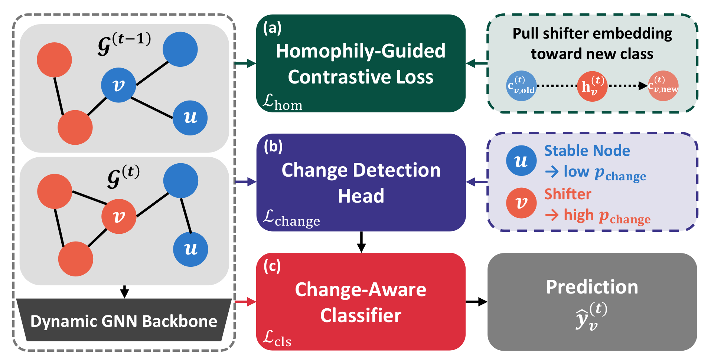

# Chasing Label Shifters: A Change-Aware Framework for Dynamic Graph Node Classification

<p align="center">
    <a href="https://pytorch.org/" alt="PyTorch">
      </a>
    <a href="https://neurips.cc/Conferences/2026" alt="Conference">
        </a>
    <a href="https://huggingface.co/datasets/jhkim611/CHASE-datasets" alt="Datasets">
        </a>
</p>

The official source code for "[Chasing Label Shifters: A Change-Aware Framework for Dynamic Graph Node Classification](<PAPER_URL>)", accepted at NeurIPS 2026.

## Overview

Entities in real-world systems often evolve over time: users shift between information consumption patterns, researchers migrate between fields, and firms transition between financial risk states. When such systems are modeled as dynamic graphs, these transitions correspond to nodes whose class labels change between consecutive snapshots, which we call *shifters*. Correctly classifying shifters is often more consequential than classifying stable nodes with persistent labels, as detecting such transitions enables timely intervention in high-stakes settings. Yet, we identify a systematic failure mode across all major dynamic graph neural network architectures: shifter performance consistently lags behind stable nodes, with errors concentrated on the old label. Our structural analysis traces this failure to *embedding inertia*: neighborhood aggregation keeps shifter representations anchored to the old-class centroid, and this effect is strongest precisely where it is hardest to correct, namely for shifters whose neighborhoods remain aligned with the old class. Guided by this finding, we propose **CHASE**, a model-agnostic **CH**ange-**A**ware framework for **S**hifting nod**E**s that wraps any dynamic GNN with targeted components for detecting label shifts and overriding stale neighborhood signals. CHASE consistently improves shifter performance across all tested models and datasets (up to 114.9% and 202.5% improvement on accuracy and F1 score, respectively) while preserving stable-node performance. We additionally contribute three dynamic graph benchmarks with naturally shifting labels, filling a gap in existing resources.



This release ships the CHASE wrapper and one representative dynamic GNN
backbone (GCN-GRU). The wrapper is backbone-agnostic: any temporal encoder
exposing `encode(x, edge_index, edge_attr)` / `reset_state()` /
`detach_state()` can be dropped into `models.py` and used without modifying
`run.py`.

## Files

| File        | Contents                                                  |
| ----------- | --------------------------------------------------------- |
| `run.py`    | Training / evaluation entry point + `ChangeAwareWrapper`  |
| `models.py` | GCN-GRU backbone + tiny `build_model` API                 |
| `utils.py`  | Dataset loading, evaluation groups, F1/accuracy helpers   |
| `README.md` | This file                                                 |

## Setup

Tested with Python 3.9, PyTorch 2.2.1 (CUDA 11.8), PyTorch Geometric 2.5.3
(+ `torch-sparse`).

```bash
pip install torch==2.2.1
pip install torch-geometric==2.5.3 torch-sparse
pip install scikit-learn huggingface_hub
```

## Datasets

The three datasets used in the paper are hosted on the Hugging Face Hub at
[jhkim611/CHASE-datasets](https://huggingface.co/datasets/jhkim611/CHASE-datasets)
(~3.9 GB total). Download them into `main_files/`:

```bash
hf download jhkim611/CHASE-datasets --repo-type dataset --local-dir main_files
```

| Dataset     | Domain          | Nodes  | Edges     | Snapshots (train/val/test) | Classes | Avg Shifter % |
| ----------- | --------------- | ------ | --------- | -------------------------- | ------- | ------------- |
| `DBLP-S`    | Academic        | 34,717 | 394,385   | 14 (9/2/3)                 | 2       | 2.62%         |
| `GossipCop` | Social Media    | 6,091  | 2,000,390 | 37 (26/5/6)                | 2       | 4.06%         |
| `Music`     | Music Streaming | 878    | 1,009,457 | 24 (15/4/5)                | 5       | 18.77%        |

Each dataset file is a Python pickle with these keys:

| key            | type / shape                | description                                |
| -------------- | --------------------------- | ------------------------------------------ |
| `edge_indices` | list of `(2, E_t)` arrays   | per-snapshot edge index                    |
| `edge_weights` | list of `(E_t,)` arrays     | per-snapshot edge weights (use 1.0 if N/A) |
| `feats`        | `(K, N, F)` float array     | per-snapshot node features                 |
| `labels`       | `(K, N)` int array          | per-snapshot node labels                   |
| `mask`         | `(K, N)` 0/1 array          | per-snapshot node activity mask            |

The loader looks for `.pkl` files under `main_files/` (or an explicit path via
`--data-dir`) and resolves stem names case-insensitively (e.g.
`--dataset dblp-s` matches `main_files/DBLP-S.pkl`). You can also use your own
dataset by saving a pickle in the format above.

The datasets are derived from DBLP-v11, FakeNewsNet, LastFM-song-listens, and
the Million Song Dataset, and are for non-commercial use; see the
[dataset card](https://huggingface.co/datasets/jhkim611/CHASE-datasets) for
details.

## Usage

### Baseline GCN-GRU

```bash
python run.py --dataset DBLP-S --device cuda:0 --seed 42
```

### Full +CHASE

```bash
python run.py --dataset DBLP-S --device cuda:0 --seed 42 --use-chase
```

CHASE uses the paper's recommended configuration (linear homophily weighting,
sqrt-dampened class-balanced classifier loss, all wrapper components on).
Hyperparameters that can be swept (defaults match the paper):

| Flag                     | Default | Description                          |
| ------------------------ | ------- | ------------------------------------ |
| `--lambda-hom`           | `0.1`   | Weight of the homophily-guided contrastive loss |
| `--lambda-change`        | `0.1`   | Weight of the change-detection loss  |
| `--contrastive-margin`   | `0.5`   | Margin in the contrastive loss       |

### Output

Results are appended to `<out-dir>/results.csv` with one row per group
(`all`, `changed`, `unchanged`). The "changed" group corresponds to
**shifters** (nodes whose label changed since the previous snapshot);
"unchanged" corresponds to **stable** nodes.

## Plugging in a new backbone

`run.py` calls `build_model(F_dim, hidden, num_classes)` and expects an
encoder with:
- `encode(x, edge_index, edge_attr) -> [N, hidden]`
- `reset_state()` / `detach_state()` (can be no-ops for stateless encoders)
- `linear` attribute used as the baseline classifier head

To swap in a new backbone, define a `nn.Module` matching this contract
in `models.py` and update `build_model` to return it.

## Citation

```bibtex
TBD
```
